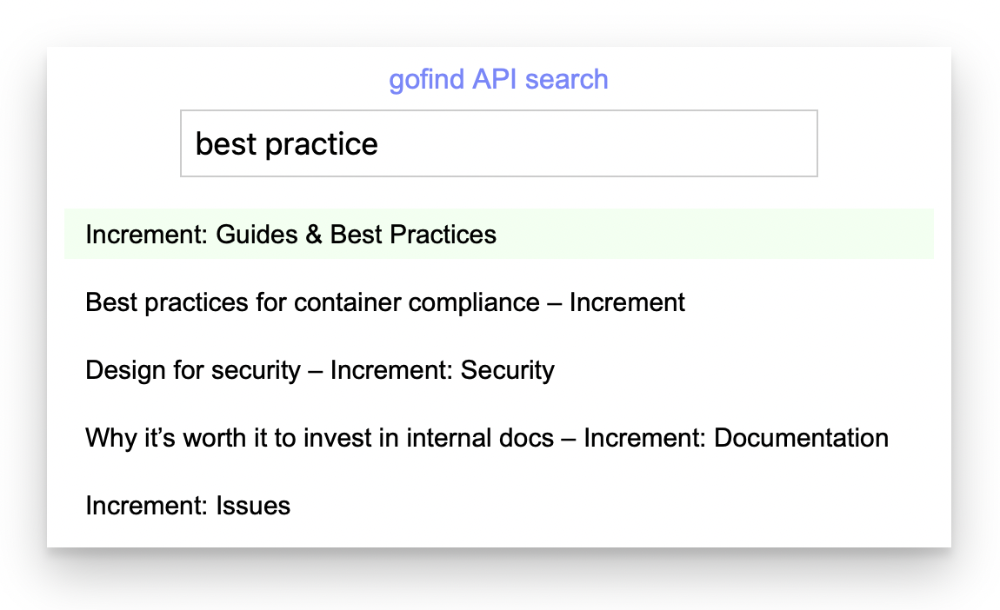

# gofind

### a small search engine written in Go

<br>

<p></p>

### Demo

This simple [CodePen](https://codepen.io/sangelone/full/eYEJxEw) shows the first 5 results for any query. It has indexed an online technical magazine and will link you to the best results.

### Features

- Multithreaded, pipelined requests can index hundreds of pages per second
- Fast web API query responses using the in-memory index
- Runs in a Docker container or can deploy to tiny Firecracker VMM (i.e. Fly.io)
- Easy to configure through environment variables
- No persistent storage required; it indexes on startup
- Designed for English, tolerates jargon and misspelling (try a search for "internetz api's versionning" in the demo)


### Why?

If you find yourself producing lots of static pages, you may reach a point where it makes sense to add a search feature so users can quickly navigate to what they're looking for. There are many variations of this situation, most commonly blogs, documentation, wikis, and help/support sites.

Many off-the-shelf options for adding search to your existing site require you to switch frameworks, use a CMS plugin, pay for hosting, or resort to a branded 3rd party search engine. Many developers, when faced with this challenge, think "I know, I'll just roll my own search!" and wind up with a poor solution using unsophisticated matching, `WHERE text LIKE '%query%'`, and no ranking to speak of. Additionally, many of the use cases above are on internal-facing networks where external search engines simply can't index.

This small, resource-conservative server is designed for those cases: you plop it into a tiny container or other place you're already running servers/services and configure it using environment variables to index your site and start serving search results over the web API. It responds to search queries very quickly from memory and provides all the features below without the need to understand or configure a complicated search product like Lucene or Elasticsearch.


### Configuring and running

Use the following environment variables to configure `gofind`'s behavior:

- `PORT` is the port number to expose the search API on, defaults to 8080
- `START_URL` where to begin crawling, example: "https://your.site/docs"
- `MAX_DEPTH` int, 0 means infinite (default is 0)
- `ALLOWED_DOMAINS` comma separated list of domain names: "your.site,foo.co"
- `DISALLOWED_DOMAINS` comma separated list of domains to avoid indexing

Run `go get` to pull down the required dependencies. Here's an example of running `gofind` locally:
```bash
START_URL=https://increment.com/ \
ALLOWED_DOMAINS=increment.com \
MAX_DEPTH=3 \
go run .
```

Test the locally running server with a query for "best practices" limited to the top 2 results:
```bash
» curl -s 'http://localhost:8080?q=best+practices&limit=2' | jq
[
  {
    "url": "https://increment.com/topics/guides/",
    "title": "Increment: Guides & Best Practices"
  },
  {
    "url": "https://increment.com/containers/container-compliance/",
    "title": "Best practices for container compliance – Increment"
  }
]
```

Here's an example of the log output you may see while it's running:
```
2021/10/17 10:41:02 Processing <...page URLs here...>
...
2021/10/17 10:41:04 Done crawling 277 pages in 1.841s, ready to process queries
2021/10/17 10:42:22 Processed query 'python' in 239.833µs with 17 results
```

The demo server is running on Fly.io using the provided `fly.toml` thusly:
```bash
# After configuring the app and its env vars, deploy it
flyctl deploy --remote-only

# Scale up as desired in specified regions
flyctl regions add lax dfw
flyctl scale count 3
```

### Warnings

⚠️ Be sure to use `ALLOWED_DOMAINS` so you are sure to **only scrape the site(s) you own**! If you accidentally crawl other sites, you will find your IP is banned from them and/or your service provider will pull the plug.

⚠️ The server is not secure. If you want auth or TLS, put it in front of incoming requests before proxying to `gofind`. A private network (VPN/VPC/etc) would also be a good measure.

<p></p>
